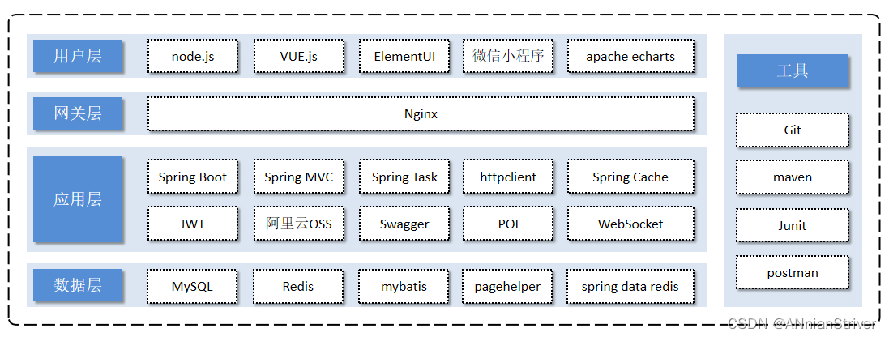

# dinodeliveries 
### 小恐龙外卖(基于苍穹外卖的后端实现)

## 完整项目技术选型：

### 此处只包含后端代码

应用层：SpringBoot、SpringMVC、Spring Task、HttpClient、Spring Cache、JWT、阿里云OSS、Swagger、POI、WebSocket

数据层：MySQL： 采用MySQL进行存储。Redis： 使用它做缓存。
Mybatis： 本项目持久层将会使用Mybatis开发。pagehelper: 分页插件。
spring data redis: 简化java代码操作Redis的API。

工具：git、maven、junit、postman

#### 项目配置如微信小程序id等已经删除，运行此项目请自行配置！

